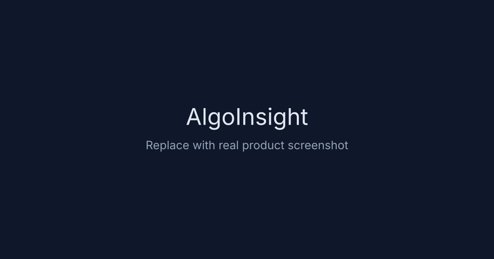

# AlgoInsight – DSA Tracker, Notes & Interview Prep Workspace

AlgoInsight is a lightweight, SEO-friendly GitHub Pages SPA for **DSA tracking**, **coding interview preparation**, **LeetCode progress management**, and **structured interview notes**.

- **Live demo:** https://bravitheja.github.io/DSA/
- **Repository:** https://github.com/bravitheja/DSA

## Screenshot

> Add a screenshot at `assets/screenshot-home.svg` and keep this section for social proof in GitHub/AI search previews.



## Features

- Pure **HTML/CSS/JavaScript** (no framework, no bundler). Rich notes use **TipTap** + **DOMPurify** loaded as **ES modules** from `esm.sh` (network required for that editor).
- Problem table with:
  - Problem (clickable LeetCode link)
  - Pattern
  - Sub Pattern
  - Difficulty badge
  - Frequency badge
  - Complexity
  - Status
  - Notes
- Tooltip with core idea/intuition when hovering problem name
- Search + filters for pattern, difficulty, company (interview data), and optional **notes flag** (color)
- Problems listed in curated frequency order (from the dataset)
- Progress dashboard with completion bar
- Dark mode toggle
- Column visibility toggles (show/hide selected columns)
- Local persistence using `localStorage` for:
  - status
  - per-problem notes (sanitized **HTML** when using the rich editor; legacy Markdown still supported in the plain fallback)
  - optional per-problem **note flag** (color for confidence / triage)
  - optional `notesFormat` per problem (`markdown` | `html`) for sync with Google Sheets column **G**
  - **General notes** (multiple documents) under `dsa-general-notes-v1:user:<googleSub>` (or `:signed-out` when not signed in)
  - theme
  - column visibility
- SEO readiness for GitHub Pages:
  - crawlable landing content in semantic HTML
  - Open Graph + Twitter social preview metadata
  - canonical tags, robots directives, `robots.txt`, `sitemap.xml`
  - `llms.txt` for AI search engine discoverability

## SEO & Indexing

AlgoInsight is optimized for discoverability on Google and AI search engines with static-first, GitHub Pages-compatible SEO:

- Canonical URL and indexable `robots` settings
- Descriptive page title and meta description with DSA/interview keywords
- Structured data (`SoftwareApplication` JSON-LD)
- Social sharing metadata (Open Graph + Twitter card)
- Crawl hints (`robots.txt`, `sitemap.xml`, `llms.txt`)

### Open Graph image recommendation

- Path configured in metadata: `assets/og-image-1200x630.png`
- Recommended size: **1200 × 630 px**
- Format: PNG or JPEG, under ~1 MB for faster social unfurl

## Project Structure

- `index.html` – layout + controls + table template
- `style.css` – theme, responsiveness, badges, tooltip, table styles
- `app.js` – data loading, rendering, filters, sort, persistence
- `notes-html-sanitize.mjs` – DOMPurify allowlist for notes HTML
- `notes-tiptap-editor.mjs` – TipTap rich editor (toolbar + ProseMirror)
- `data.json` – editable problem dataset
- `README.md` – docs

## Data Format

Each problem in `data.json` supports:

```json
{
  "problem": "Two Sum",
  "pattern": "Hashing",
  "subPattern": "Complement lookup",
  "difficulty": "Easy",
  "frequency": "High",
  "complexity": "O(n) time | O(n) space",
  "coreIdea": "Use hashmap to find complement",
  "link": "https://leetcode.com/problems/two-sum"
}
```

Backward compatibility is built in: if any field is missing, defaults are used.

## Run Locally

Use a local server (required for `fetch("data.json")`):

```bash
python -m http.server 8000
```

Then open `http://localhost:8000`.

## Deploy on GitHub Pages

1. Push this repo to GitHub.
2. Go to **Settings → Pages**.
3. Choose:
   - **Source:** Deploy from a branch
   - **Branch:** `main`
   - **Folder:** `/ (root)`
4. Save and wait for deployment URL.

## Dev Notes:

### Apps Script changes:
After you edit SyncWebApp.gs, use Deploy → Manage deployments → Edit → New version → Deploy so the web app URL keeps using the latest code.
### OAuth origins:
If you ever change the site URL (custom domain, different repo path), add that origin under the Web client’s Authorized JavaScript origins in Google Cloud.
### Sheet:
Your progress is in localStorage first; sync pushes/pulls against the sheet—useful to know if you clear browser data or use another device.

The **Progress** tab uses columns: `googleSub`, `problemKey`, `status`, `notes`, `updatedAt`, `noteFlag`, `notesFormat` (`markdown` or `html`; empty = client treats as Markdown). Deploy the latest [`SyncWebApp.gs`](scripts/google-apps-script/SyncWebApp.gs) and run a sync so the script can add missing headers/columns.

Add a **GeneralNotes** tab (created automatically on first sync) with headers: `googleSub`, `noteId`, `title`, `body`, `noteFlag`, `updatedAt`. The `body` cell stores sanitized HTML (same size limits as problem notes).

**Redeploy** the Apps Script web app after editing `SyncWebApp.gs` so `pullGeneralNotes` / `pushGeneralNotes` are available; older deployments will log a skipped pull for general notes until upgraded.
