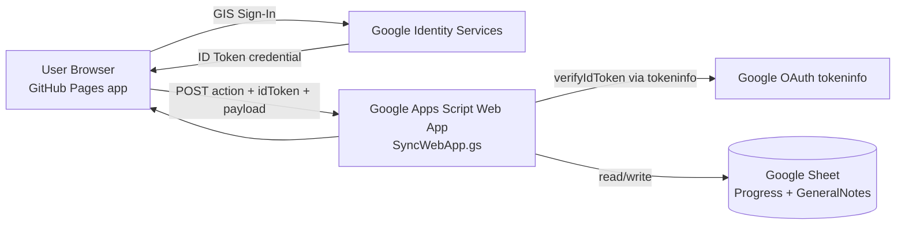
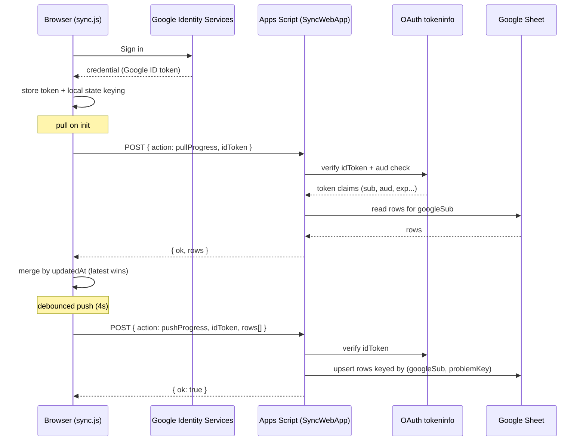
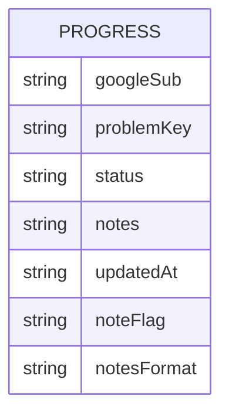
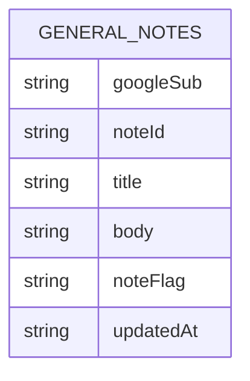

# Google Sheets Sync Architecture

## Scope

This document captures the **current** sync approach used by this repo:

- Frontend: static app on GitHub Pages
- Auth bootstrap: Google Identity Services (GIS) in browser
- Sync backend: Google Apps Script Web App (`SyncWebApp.gs`)
- Storage: Google Sheet tabs (`Progress`, `GeneralNotes`)

It also lists production caveats and a recommended near-term hardening path.

## High-Level Architecture



## Runtime Request Flow



## Data Model (Sheet Tabs)

### `Progress` sheet



Composite logical key: `googleSub + problemKey`

### `GeneralNotes` sheet



Composite logical key: `googleSub + noteId`

## Local-First Sync Behavior

- App writes immediately to browser state (`localStorage`), then pushes in background.
- Dirty sets (`dirty`, `generalDirty`) are flushed on debounce and keepalive paths.
- Merge strategy is timestamp-based (`updatedAt`): newer record wins.
- Token-less mode uses signed-out storage keys; signed-in mode scopes by Google `sub`.

## Security and Validation in Apps Script

From `SyncWebApp.gs`:

- Validates Google ID token (`tokeninfo` endpoint + `aud` match with `GOOGLE_CLIENT_ID`).
- Uses `LockService` to avoid concurrent write corruption.
- Sanitizes:
  - `noteFlag` against allowlist
  - `notesFormat` (`html`/`markdown`)
  - formula-leading characters (`= + - @`) to prevent sheet formula injection
- Enforces max note/body length (`MAX_NOTE_CHARS`).

## Operational Characteristics

- Very low infra overhead (no dedicated server needed).
- Easy deploy/update via Apps Script web app versions.
- Best for small-to-medium personal/team workloads.

Trade-offs:

- Apps Script quotas/latency can become bottlenecks at scale.
- Browser-managed token/session is less robust than server refresh-session architecture.
- `tokeninfo` verification per request is simple but not optimal for high throughput.

## Current Endpoints/Actions

Single Apps Script `doPost` endpoint with actions:

- `pullProgress`
- `pushProgress`
- `pullGeneralNotes`
- `pushGeneralNotes`

Request contract:

```json
{
  "action": "pushProgress",
  "idToken": "<google-id-token>",
  "rows": []
}
```

## Recommended Hardening (Incremental)

1. Keep this architecture for now, but shorten client token lifetime behavior to true JWT `exp`.
2. Add a Cloud Run facade in front of Apps Script for:
   - rate limiting
   - centralized logs/alerts
   - future refresh-session migration
3. Migrate fully to Cloud Run + Firestore sessions when ready (see `docs/auth-session-refresh-plan.md`).

## Related Files

- `sync.js`
- `scripts/google-apps-script/SyncWebApp.gs`
- `docs/auth-session-refresh-plan.md`
